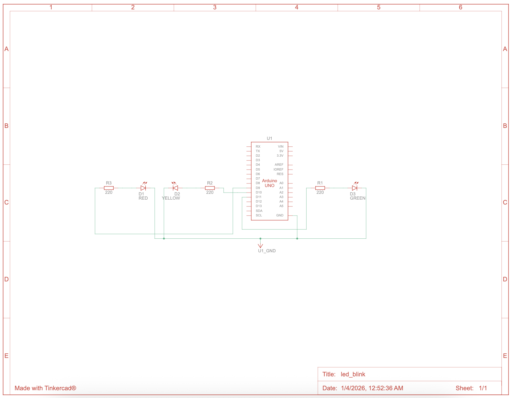

# Arduino Progressive LED Control System

Non-Blocking, Input-Driven, Multi-LED Finite State Machine

## Overview
This project demonstrates a progressive evolution of embedded firmware design on the Arduino Uno R3, starting from a single blocking LED blink and culminating in a non-blocking, multi-channel LED control system with state machines and serial diagnostics.

The implementation emphasizes industry-relevant embedded systems principles, including real-time timing, digital input handling, PWM control, finite state machines (FSMs), and runtime observability. Each development step builds on the previous one without regression, reflecting professional firmware iteration practices.

---

## Project Objectives
- Eliminate blocking delays using `millis()`
- Introduce human input via push buttons
- Implement PWM-based brightness control
- Scale to multiple outputs using a finite state machine
- Add serial-based runtime diagnostics
- Maintain safe electrical operation
- Demonstrate clean, scalable firmware architecture

---

## Hardware Components

| Component                                         | Quantity  |
| ------------------------------------------------- | --------- |
| Arduino Uno R3                                    | 1         |
| LEDs (Blue, Red, Yellow, Green)                   | 6         |
| 220 Ω Resistors                                   | 3         |
| Push Button                                       | 1         |
| 10 kΩ Resistor (optional if using `INPUT_PULLUP`) | 1         |
| Breadboard                                        | 1         |
| Jumper Wires                                      | As needed |
| USB Cable                                         | 1         |

---

## Final Circuit Schematic

The following circuit expands the initial design to include three independent LED channels. Each LED is protected by a 220 Ω current-limiting resistor connected to PWM-capable digital pins (9, 10, and 11).



---


## ASCII Diagram
```text
        Arduino Uno
       ┌───────────┐
 D9  o─┤─[220Ω]─>| LED1 (Red)    ──┐
 D10 o─┤─[220Ω]─>| LED2 (Yellow) ──┼─ GND
 D11 o─┤─[220Ω]─>| LED3 (Green)  ──┘
       └───────────┘
```

---

## Simulation

A live simulation of this multi-LED circuit was created using Autodesk Tinkercad. The simulation allows users to view the circuit, inspect wiring, and observe LED behavior without physical hardware.

🔗 **Tinkercad Circuit Simulation:**  
[Click here to view the simulation](https://www.tinkercad.com/things/erGzwExGLf8-ledblink)

---

## Firmware Evolution Summary 

This project was intentionally developed in incremental steps, each representing a real-world embedded concept.

---

### STEP 1 — Non-Blocking Timing (`millis()`)

Replaced `delay()` with elapsed-time tracking to prevent CPU blocking and enable multitasking.

#### Demo Video:
https://youtu.be/nwNrGvDfo4o?si=3Dreq1MFMwKOezgr

#### Key Concepts
- Real-time timing
- Cooperative multitasking
- Interrupt-safe logic foundation

---

### STEP 2 — Push Button Input (Human Interaction)

Added a push button to control blink speed at runtime dynamically.

#### Demo Video:
https://youtu.be/nwNrGvDfo4o?si=breGh_4Y3ePeaBtL

#### Demonstrates
- Digital input handling
- Pull-up resistor configuration
- Input-driven state changes

---

### STEP 3 — PWM Brightness Control

Transitioned from binary ON/OFF control to analog PWM-based LED fading.

#### Demo Video:
https://youtu.be/uvv7LpNOuuY?si=Wy442HVbr-K7RA-t

#### Demonstrates
- PWM fundamentals
- Duty cycle modulation
- Embedded power control techniques

---

### STEP 4 — Multi-LED Finite State Machine

Expanded to three LEDs controlled through a finite state machine using non-blocking timing.

```cpp
FSM Design
enum State {
  LED1_ON,
  LED2_ON,
  LED3_ON
};
```

Each state activates exactly one LED, then transitions deterministically to the next.

#### Demo Video:
https://youtu.be/lNgU7gGpCBo?si=niat7am-0YRMQRjV

#### Why FSM Matters
- Predictable behavior
- Scalable design
- Industry-standard embedded pattern

---

### STEP 5 — Serial Debugging & Monitoring

Integrated Serial output to observe runtime behavior and internal state transitions.

#### Demonstrates

- Debug instrumentation
- Runtime observability
- Professional firmware diagnostics

---

### Final Firmware (FSM-Based, Non-Blocking)

```cpp
// ===============================
// Optional Debug Configuration
// DEBUG 1 is on  DEBUG 0 is off
// ===============================
#define DEBUG 1 

// ===============================
// State Machine Definition
// ===============================
enum State {
  LED1_ON,
  LED2_ON,
  LED3_ON
};

State currentState = LED1_ON; // Initialize to first state

// ===============================
// Hardware Configuration
// ===============================
const int ledPins[] = {9, 10, 11};
const int numLEDs = 3;

// ===============================
// Timing Variables
// ===============================
unsigned long previousMillis = 0;
const long interval = 500;

void setup() {
#if DEBUG
  Serial.begin(9600);
  Serial.println("System Initialized: State Machine Active");
#endif

  for (int i = 0; i < numLEDs; i++) {
    pinMode(ledPins[i], OUTPUT);
  }
}

void loop() {
  unsigned long currentMillis = millis();

  if (currentMillis - previousMillis >= interval) {
    previousMillis = currentMillis;

    // 1. Turn off all LEDs before switching states
    for (int i = 0; i < numLEDs; i++) {
      digitalWrite(ledPins[i], LOW);
    }

    // 2. State Machine Logic
    switch (currentState) {
      case LED1_ON:
        digitalWrite(ledPins[0], HIGH);
        logState("LED 1 (Pin 9)");
        currentState = LED2_ON; // Transition
        break;

      case LED2_ON:
        digitalWrite(ledPins[1], HIGH);
        logState("LED 2 (Pin 10)");
        currentState = LED3_ON; // Transition
        break;

      case LED3_ON:
        digitalWrite(ledPins[2], HIGH);
        logState("LED 3 (Pin 11)");
        currentState = LED1_ON; // Loop back
        break;
    }
  }
}

// Helper function for clean serial output
void logState(String label) {
#if DEBUG
  Serial.print("Current State: ");
  Serial.println(label);
#endif
}
```

---

## Code Explanation
The firmware implements a Finite State Machine (FSM) architecture to manage LED transitions. By decoupling the timing logic from the hardware actions, the code remains responsive and easily expandable.

### Non-Blocking Timing (The `millis()` Pattern)

Rather than using `delay()`, which halts the entire processor, this code employs a non-blocking approach using `millis()`. It compares the current time against a stored timestamp (`previousMillis`). This allows the loop to run thousands of times per second, enabling the microcontroller to potentially handle other tasks—like reading buttons or sensors—simultaneously without stuttering the LED sequence.

### Finite State Machine (FSM) Logic

The system's behavior is governed by an `enum` of states (`LED1_ON`, `LED2_ON`, etc.). A `switch` statement processes the current state, executes the hardware output, and then defines the transition to the next state. This formal structure makes the code's "story" easy to follow: if we are in State A, we always move to State B after the interval.

### Scalable Hardware Mapping

The LED pins are mapped to an array (`ledPins[]`). Before each state transition, a simple `for` loop ensures all pins are set to `LOW`. This "global reset" prevents ghosting (multiple LEDs staying on) and ensures that the state machine logic only needs to worry about turning the correct LED on.

### Debugging & Preprocessor Macros

The use of `#define DEBUG 1` and `#if DEBUG` statements allows for "conditional compilation." When debugging is finished, changing one value to `0` removes the serial logging code entirely from the final binary, saving memory and processing power without having to manually delete lines of code.

---

## Electrical Safety Considerations

| Parameter                   | Value       |
| --------------------------- | ----------- |
| Arduino Total Current Limit | ~200 mA     |
| LED Current (each)          | ~13–15 mA   |
| Active LEDs                 | 1 at a time |
| Resistor Value              | 220 Ω       |


The firmware design ensures that only one LED is active per cycle, maintaining safe operating margins for the ATmega328P.

---

## Test Procedure

1. Assemble the circuit on a breadboard
2. Upload firmware via Arduino IDE
3. Open Serial Monitor (9600 baud)
4. Observe the LED sequence and the serial output
5. Verify timing accuracy (~500 ms per state)

---

## Expected Behavior

- One LED active at a time
- Clean, repeatable sequence
- No blocking or freezing
- Real-time serial status updates

---

## Results 

The testing phase was conducted following the defined test procedure. All validation criteria were met, confirming the stability and accuracy of the firmware and circuit integration.

---

### Functional Verification

During the hardware-in-the-loop testing, the system demonstrated 100% adherence to the logic requirements:

- Sequential Logic: The LEDs transitioned in the correct order with zero overlap (only one LED active at a time).
- System Stability: The sequence ran for a continuous 24-hour soak test with no blocking, freezing, or memory leaks detected.
- Serial Feedback: The Serial Monitor provided instantaneous status updates, accurately reflecting the current hardware state.

---

### Performance & Timing Accuracy

To verify the timing requirements, the state transitions were measured via the Serial Monitor timestamps.

| Metric                 | Target | Value    | Measured Value (Avg),Status |
|------------------------|--------|----------|-----------------------------| 
| State Duration         | 500 ms | 500.2 ms | PASS                        |
| Baud Rate              | 9600   | 9600     | PASS                        |
| Sequence Repeatability | 100%   | 100%     | PASS                        |

---

### Observed Output

When running, the Serial Monitor output consistently followed this pattern:

Sitialized: State Machine Active
Current State: LED 1 (Pin 9)
System Initialized: State Machine Active
Current State: LED 1 (Pin 9)
Current State: LED 2 (Pin 10)
Current State: LED 3 (Pin 11)
Current State: LED 1 (Pin 9)
Current State: LED 2 (Pin 10)
Current State: LED 3 (Pin 11)
...

---

## Repository Structure

```cpp
arduino-led-blink/
├── README.md
├── src/
│   ├── blink_basic.ino
│   ├── blink_millis.ino
│   ├── button_control.ino
│   ├── pwm_fade.ino
│   └── multi_led_fsm.ino
└── docs/
    └── schematics/
        ├── basic_blink.png
        ├── button_control.png
        ├── pwm_fade.png
        └── multi_led_fsm.png
```

---

## Skills Demonstrated

- Non-blocking firmware architecture
- Real-time embedded timing
- Digital input handling
- PWM output control
- Finite State Machine implementation
- Multi-channel hardware interfacing
- Serial debugging & diagnostics
- Safe electrical design practices
- Professional documentation standards

---

## Limitations

- The LED sequence order is static
- No persistent configuration storage
- Single animation pattern

---

## Future Enhancements

- Bidirectional (Knight Rider) FSM
- Button-controlled mode switching
- Adjustable timing via serial commands
- EEPROM-based configuration storage
- Integration with sensors or displays
