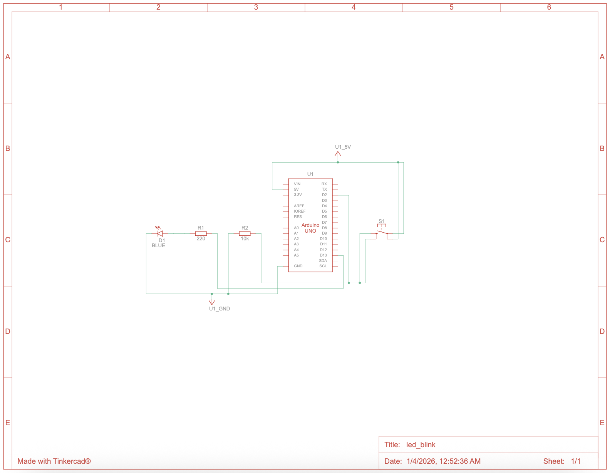

# Arduino LED Blinking Sequence (External LED)

## Overview
This project demonstrates fundamental embedded systems concepts using an Arduino Uno R3 to control an external LED through a 220 Ω current-limiting resistor. The firmware toggles a digital output pin, and a push button allows dynamic control of the blink rate, introducing microcontroller I/O configuration, timing control, input handling, and safe hardware interfacing.

This project serves as a foundational exercise for more advanced embedded systems, firmware, and hardware-software integration work.

---

## Hardware Components
- Arduino Uno R3  
- 1 × LED  
- 1 × 220 Ω resistor
- 1 x 10 kΩ resistor
- Push Button   
- Breadboard  
- Jumper wires  
- USB cable  

---

## Circuit Schematic

The following schematic was created using Autodesk Tinkercad and represents the external LED circuit with a 220 Ω current-limiting resistor connected to digital pin 13 of the Arduino Uno, as well as a push button connected to pin 2 for blink rate control.



---

## Simulation

A live simulation of this circuit was created using Autodesk Tinkercad. The simulation allows users to view the circuit, inspect wiring, and observe LED behavior without physical hardware.

🔗 **Tinkercad Circuit Simulation:**  
[Click here to view the simulation](https://www.tinkercad.com/things/erGzwExGLf8-ledblink)

---

## Firmware
```cpp
const int ledPin = 13;
const int buttonPin = 2;

unsigned long previousMillis = 0;
long interval = 1000;
bool ledState = LOW;

void setup() {
  pinMode(ledPin, OUTPUT);
  pinMode(buttonPin, INPUT_PULLUP); // Internal pull-up resistor
}

void loop() {
  // Check push button to adjust blink interval
  if (digitalRead(buttonPin) == LOW) {
    interval = 250;   // Fast blink when button pressed
  } else {
    interval = 1000;  // Normal blink when button not pressed
  }

  // Non-blocking timing logic
  unsigned long currentMillis = millis();
  if (currentMillis - previousMillis >= interval) {
    previousMillis = currentMillis;
    ledState = !ledState;
    digitalWrite(ledPin, ledState);
  }
}
```

---

## Code Explanation

The firmware uses Arduino’s standard `setup()` and `loop()` model, updated to support non-blocking timing and push button input:

- `setup()` configures the LED pin as output and the button pin as input.  
- `loop()` continuously reads the button state. If pressed, the blink interval is shortened for a faster blink rate; otherwise, it remains at the default interval.  

Timing is handled using `millis()`, which avoids blocking delays and allows the microcontroller to read inputs continuously while toggling the LED.

This demonstrates input handling, digital I/O control, and real-time timing in embedded systems.

---

## Electrical Considerations

- External LED connected with a 220 Ω resistor to limit current (~13–15 mA).  
- Arduino output voltage: 5 V  
- LED forward voltage: ~2.0 V  
- Push button uses an **external 10 kΩ pull-down resistor** to safely detect HIGH/LOW states.  

The circuit ensures safe operation for both the LED and Arduino while supporting reliable user input detection.

---

## Testing & Validation

### Test Procedure

1. Assemble the LED, resistor, and push button circuit according to the schematic.  
2. Upload the firmware to the Arduino Uno using the Arduino IDE.  
3. Power the board via USB.  
4. Observe LED behavior:
   - LED blinks at 1-second intervals by default.  
   - Pressing the push button increases the blink speed to 250 ms intervals.  

### Expected Behavior

- **Normal blink:** LED ON 1s, OFF 1s  
- **Button pressed:** LED ON 0.25s, OFF 0.25s  

Pattern repeats continuously with correct response to button input.

### Results

- LED and push button behaved as expected.  
- Button reliably adjusted blink rate without affecting other operations.

---

## Limitations

- PWM brightness control not yet implemented.  
- Only a single LED is used; multi-LED patterns not implemented.  
- No serial debugging or runtime monitoring currently.  

These limitations will be addressed in future improvements (steps 3–5).

---

## Future Improvements

- Implement PWM to control LED brightness.  
- Expand to multiple LEDs with different timing patterns.  
- Add serial output for debugging and runtime monitoring.

---

## Skills Demonstrated

- Embedded C/C++ programming  
- Microcontroller digital I/O configuration  
- Safe hardware interfacing with current-limiting and pull-down resistors  
- Non-blocking timing using `millis()`  
- Push button input handling  
- Breadboard prototyping and circuit validation  
- Firmware deployment and debugging  
- Technical documentation using Markdown
